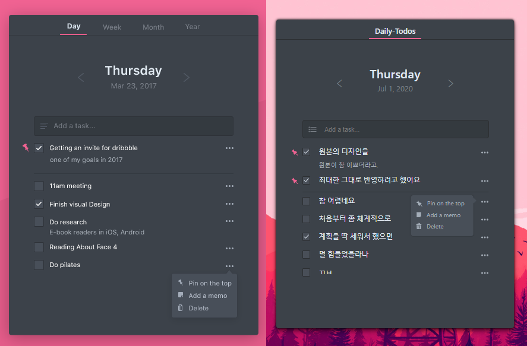

### Daily-Todos
최근에 [생활코딩](https://opentutorials.org/module/4058)으로 React를 공부하고,  
대략적으로 머리에 날라다니는 개념을 붙잡기 위해  
React를 이용해서 뭐라도 만들어봐야겠다는 생각이 들었다.  

웹을 다루는 사람이라면 TODO LIST를 기본적으로 만들 줄 알아야 한다는 말을  
예전에 우연히 본 적이 있었기에, 무엇을 만들지는 크게 고민하지 않았다.  

내 성격상 똑같은 걸 두 번 하기 싫어할 게 뻔하기 때문에  
이왕 TODO LIST를 만들기로 결심한 거,  
내가 할 수 있는 한 최대한 고퀄리티의 TODO LIST를 만들어보자는 생각이 들었다.  

예전에 Dribbble에서 [이지혜](http://jihyeleee.com/)님이 디자인하신 [TODO LIST](https://dribbble.com/shots/3384144-Hello-Dribbble)가  
엄청 괜찮은 것 같아서 좋아요를 눌러놨던 적이 있다.  
TODO LIST를 만들어야겠다는 생각을 하자마자 기억이 번뜩 떠올랐고,  
얼른 다시 찾아가봤는데 여전히 맘에 들었다.  

만약 그 디자인대로 만들수만 있다면,  
이만큼 이쁘게 만든 TODO LIST를 별로 본 적이 없었기 때문에  
참 괜찮은 결과물을 만들 수 있을 거라는 생각이 들었다.  

일단 디자인을 사용하기 전에 이지혜님께 허락을 구하는 메일을 보냈는데,  
감사하게도 너무나 흔쾌히 허락을 해주셔서 작업을 신속하게 시작할 수 있었다.  


###### 좌측이 원본, 우측이 결과물.  

이름을 Daily-Todos로 정한 이유는..  
원본의 디자인 상단에 보면 Day, Week, Month, Year로 기능이 나눠져 있다.  
근데 디자인 구현은 Day만 되어있어서  
이 컨셉에 맞게 Week, Month, Year를 다 디자인하고 구현하기에는  
시간이 너무 오래 걸리지 않을까 하는 생각에 그냥 Daily만 하기로 해서.  
그래서 이름이 Daily-Todos가 되었다.  

사진을 보며 먼저 생각나는 것부터 간단하게 언급을 해보겠다.  
우선, 아쉽게도 원본과 똑같은 모양의 아이콘을 구할 수가 없었다.  
차선책으로 비슷한 아이콘들을 구해서 집어넣었는데,  
뭐 얼핏 보면 그렇게 크게 차이나진 않는 듯..ㅎㅎ;  

나름 UX도 신경쓰려고 노력했는데, 능력의 한계로 인해 타협을 많이 했다.  
예를 들면 스크롤같은 경우.  
todo 갯수가 너무 많아져서 특정 갯수 이상으로 넘어가버리면 스크롤이 되도록 했다.  
근데, 스크롤은 사실 옆에 스크롤 바가 있어야 스크롤이 되는지 알 텐데  
스크롤이 표시되면 비율이 깨져버린다. 그리고, 무엇보다 너무 안이뻐진다.  
그래서 스크롤을 아예 삭제해버렸다..  

툴팁 메뉴도 꽤나 골칫거리였다.  
원본은 메뉴 버튼을 누르면 아래쪽으로 툴팁 메뉴가 튀어나오게 디자인되었는데,  
구현을 하고 보니 아래쪽의 다른 메뉴 버튼을 가려버리는 불상사가 발생했다.  

아래쪽으로 툴팁을 내리는 게 미관적으로 가장 좋았지만  
일단은 눈물을 머금고 왼쪽으로 툴팁을 빼버리기로 했다.  
(근데, 사실 마음에 안들어서 언젠가는 아래쪽으로 내려버릴지도 모른다.)  

최대한 사용자에게 친화적이도록 UI를 구성하고자 했지만  
디자인과 컨셉을 유지하려다보니 타협해야 할 부분들이 생각보다 많더라..  

### 첫 React 프로젝트
React에 관해 이야기를 좀 하자면, React를 처음 사용해봐서 그런지  
사용법도 정확히 모르겠고, 내가 지금 맞게 짜고 있는 건지 자꾸 의심이 되기도 하고.  
그래도 기존에 Vanilla JS에서 모듈을 사용했던 경험을 떠올려  
나름 빠르게 적응한 것 같기도 하다.  

아직은 React 초보이다 보니, component나 state라는 새로운 개념을 접하면서  
그 개념에 갇혀버린 느낌이 든다. 생각이 제한되고 머리가 복잡해지는 느낌.  
조금 익숙해지면 이것저것 과감하게 좀 시도해보면서   
자연스럽게 사용할 수 있게 되어야 할 텐데.  

사실, 이런 새로운 프레임워크를 접하다보면 항상 드는 생각이 있다.  
기존에 이 프레임워크를 사용하던 사람들이 찾아낸 합리적인 코딩 방식이 있을 건데,  
지금 내가 하는 코딩이 그 방식에 맞는건지 의문이 들 때가 많다.  

지금 이게 성능적으로 괜찮은 코딩인지. 프로젝트의 스케일이 커져도 문제가 없는지.  
지금은 결과물의 스케일이 작다보니 문제가 없지만  
스케일이 커져도 괜찮을지. 잘 버텨줄 지 걱정이 자꾸 된다.  

이래서 회사에 들어가면 사수를 붙혀주나보다.  
이런 고민이 들 때마다 좀 물어보라고.  

### 기능적으로 봤을 땐
기능적인 면에서는, TODO LIST가 갖춰야 할 엔간한 기능은 다 구현했다고 생각한다.  
그것도 버그 없이.  

떠오르는 것만 몇 개 얘기해보자.  
우선, id부터 얘기하자면.  
id는 CRUD의 Delete를 구현하는 데에 필요했다.  
이를 위해서는 무조건 unique한 id가 필요했는데, 그 이유는 동일한 id를 가지는  
두 개의 항목이 있을 경우, 의도치 않게 둘을 동시에 삭제하는 경우가 생겨버린다.  

이를 방지하기 위해 처음에 생각했던 것은  
배열의 마지막 요소가 가진 id에 1을 더해주는 것.  
그러면 무조건 마지막으로 들어온 요소에 1이 더해지기 때문에   
절대로 중복될 일이 없을거라 생각했다.  
```javascript
const newID = array[array.length - 1].id + 1;
```
실제로도 잘 적용됐고, 테스트 동안에도 문제없이 동작했다.  
하지만 pin 고정 기능을 넣는 순간, 엉망이 되어버렸다.  
pin으로 고정하는 기능을 넣으면 배열의 순서가 바뀌어버리기 때문에  
마지막 요소의 id가 꼭 제일 크다는 보장이 없어져버린다.  
그래서 중복되는 id가 발생했다.  

이에 대한 해결책으로 발견한 두 번째 방법은 바로  
랜덤 함수를 이용하는 방법.  
```javascript
const newID = Math.random().toString(36).substr(2, 9);
```
랜덤한 수를 만들어내서, 36진수 숫자 9자리로 표현한다.  
아마 내가 50살이 되기 전까지는 중복되는 수를 볼 일이 없을거라 생각했는데  
테스트 도중에 딱 한 번 중복이 되긴 하더라.  
소름이 돋았다 아주 그냥  


###### 테스트 단계라 디자인이 좀 다르다.

pin기능은 마지막에 버그를 발견해서 조금 머리가 아팠다.  
사실 뭐 그렇게 복잡한 건 아니었지만, 그냥 배포하기 직전에 발견되니까  
약간 더. 토끼 똥만큼 더 짜증나긴 했다.  

배열로 저장되어있는 todo 데이터들 중에서 pin되어있는 애들을 따로 뽑는다.  
그리고 걔네들을 또 날짜별로 가지런히 분류되게 하기 위해,  
sort 함수를 써서 날짜 순서대로 정렬한다.  
그런 다음 날짜 별로 가장 마지막에 있는 요소에다가  
밑줄이 그어지도록 하면 된다.  

그렇게 하면 pin 고정되어있는 애들이랑 나머지 애들을 구분하는 검은 선을 그을 수 있다.  

사실 아직 해결되지 않은 에러가 하나 있다.  
기능적으로는 전혀 문제가 없지만, 자꾸 콘솔 창에 떠서 신경을 쓰이게 하는 에러.  
체크박스를 클릭해서 체크를 하면, uncontrollable한 객체를 control했다던가 뭐라던가  

기능 상으로 문제가 없고, deploy를 하고 나니 에러가 뜨지 않기에  
일단은 넘어가고, 나중에 더 지식이 생기면 그 때 해결하는걸로...  
아무리 검색을 해도 도저히 모르겠더라..  

### 뭐 결국에는
부족한 코딩 실력을 가지고 어떻게든 구현을 해냈다.  
구현을 끝내고, 테스트를 마치고 보니 마치 하나의 훈장처럼  
눈부시게 하얀 흰머리가..  

그래도 뭐 만들고 싶었던 기능들 다 만들었고  
애니메이션도 넣을 수 있을 만한 곳에는 웬만큼 넣은 것 같고  
원본 디자인에도 최대한 가깝게 만든 것 같아서  
나름 만족스러운 결과물이다.  

디자인도 디자인이지만, 최대한 기능을 버그 없이 구현하고자 노력했다.  
뭐 하나라도 버그가 발견되면 도저히 가만히 두고 넘어갈 수가 없는 성격이라  
버그가 발견되면 무조건 고치려고 했던 것 같다.  

배경은, 사실 뭘 넣어야될지 몰라서  
그냥 내가 좋아하는 게임 일러스트를 하나 쑤셔넣었다. 색깔 맞는걸로.  

